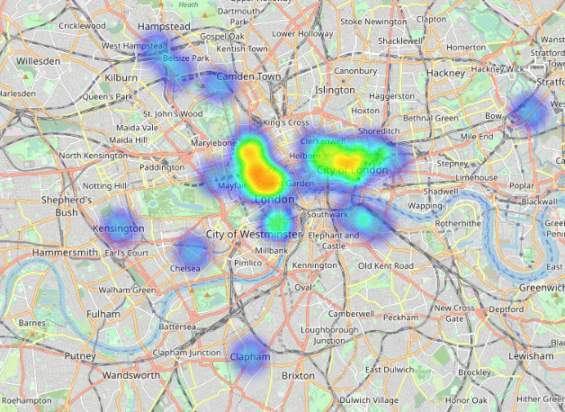
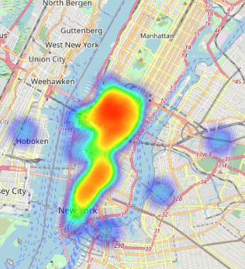
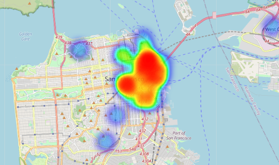
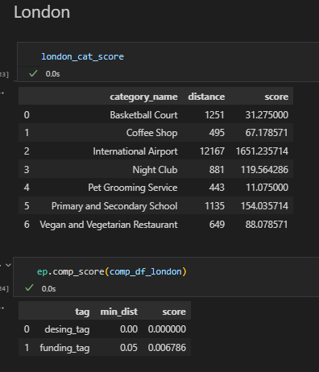
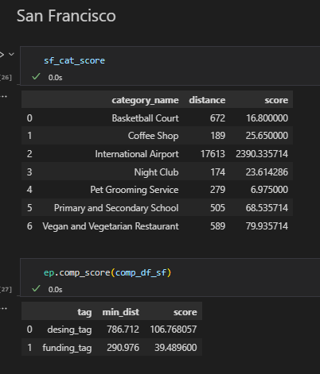
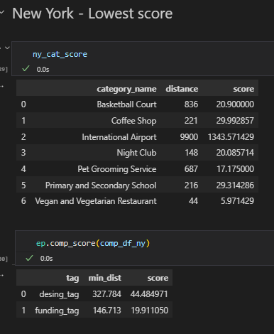
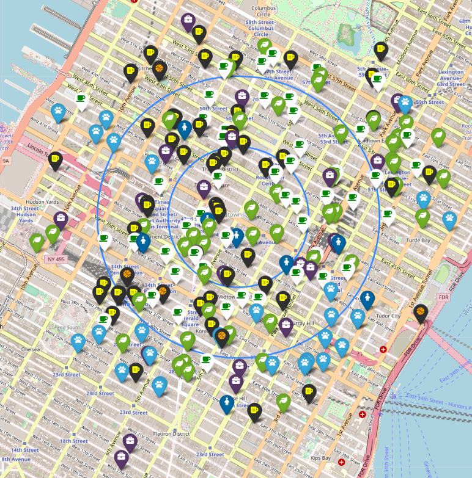
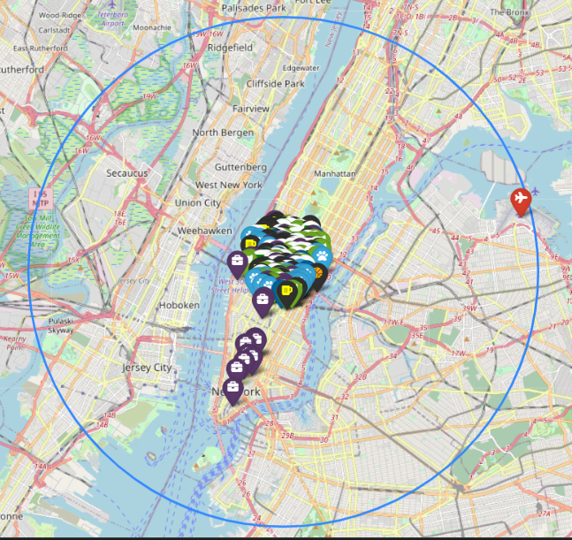

# GeoSpatial Data Project - Blasi
 
 

## <b> In this project, we were asked to extract data from 2 different sources, using API requests and Mongo NoSQL databases to determine where would an office be ideally opened, considering predefined conditions.

 
TODO's

You recently created a new company in the GAMING industry. The company will have the following scheme:

    20 Designers
    5 UI/UX Engineers
    10 Frontend Developers
    15 Data Engineers
    5 Backend Developers
    20 Account Managers
    1 Maintenance guy that loves basketball
    10 Executives
    1 CEO/President.

As a data engineer you have asked all the employees to show their preferences on where to place the new office. Your goal is to place the new company offices in the best place for the company to grow. You have to find a place that more or less covers all the following requirements (note that it's impossible to cover all requirements, so you have to prioritize at your glance):

    Designers like to go to design talks and share knowledge. There must be some nearby companies that also do design.
    30% of the company staff have at least 1 child.
    Developers like to be near successful tech startups that have raised at least 1 Million dollars.
    Executives like Starbucks A LOT. Ensure there's a starbucks not too far.
    Account managers need to travel a lot.
    Everyone in the company is between 25 and 40, give them some place to go party.
    The CEO is vegan.
    If you want to make the maintenance guy happy, a basketball stadium must be around 10 Km.
    The office dog—"Dobby" needs a hairdresser every month. Ensure there's one not too far away.

 

## <b> The full process is shown in the Jupyter notebook, in summary:

    1- Queried the companies collection in Mongo to get possible tech hubs that comply with the conditions predefined.
    2- Narrowed it down do London, New York and San Francisco.

.
    
    
    London

 

    New York

 

    San Francisco

 

    3- Generated a Json datasource from the Foursquare API to enrich the dataset, loaded it into Mongo
    4- Reindexed and performed Geoqueries to narrow down the locations
    5- Calculated the distance to the candidate locations, defined a score depending on each topics importance and determined NY as the best location.

 
 

 
 

 
 

 
 

    